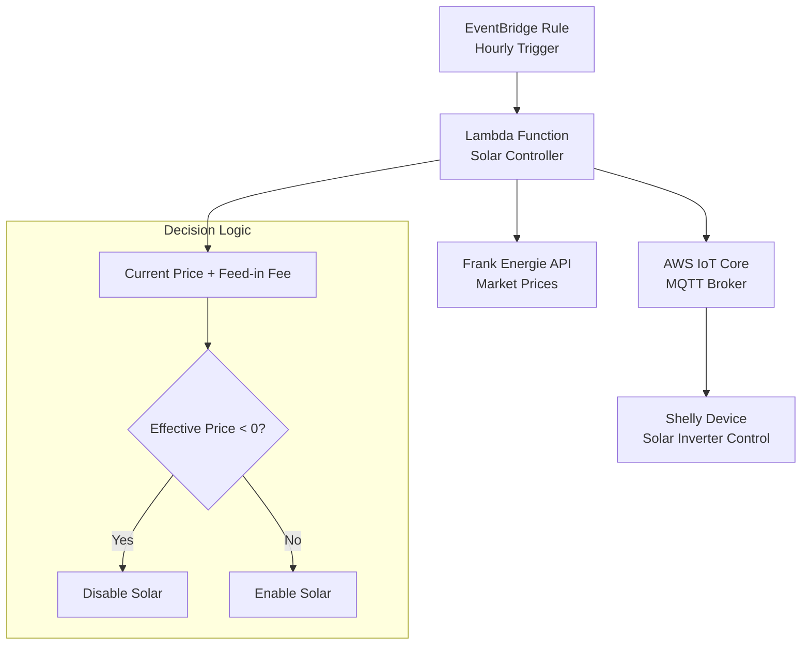

# AWS MQTT DRM Controller

An automated solar panel control system that optimizes energy production based on real-time electricity market prices. The system automatically disables solar inverters when electricity prices are negative (after accounting for feed-in fees) to prevent financial losses.

## Architecture



## Components

### AWS Infrastructure (Terraform)
- **IoT Core**: MQTT broker for device communication
- **Lambda Function**: Go-based controller logic
- **EventBridge**: Hourly trigger for price checks
- **IAM**: Secure permissions for IoT and Lambda operations

### Lambda Function (Go)
- Fetches real-time electricity prices from Frank Energie API
- Calculates effective price (market price + feed-in fee)
- Sends MQTT commands to Shelly device via IoT Core
- Runs every hour via EventBridge trigger

### Shelly Device
- IoT device connected to solar inverter
- Receives MQTT commands to enable/disable solar production
- Uses AWS IoT Core for secure communication

## Key Features

- **Real-time Price Monitoring**: Fetches hourly electricity prices from Dutch energy market
- **Automated Decision Making**: Disables solar when prices are negative (after feed-in fees)
- **Contract Date Awareness**: Only activates after specified contract start date
- **Secure IoT Communication**: Uses AWS IoT Core with certificate-based authentication
- **Cost Optimization**: Prevents financial losses during negative price periods

## Configuration

### Required Variables
- `aws_region`: AWS region for deployment (default: eu-west-1)
- `client_id`: Unique identifier for the Shelly device

### Constants (Lambda)
- `PURCHASE_FEE_FEED_IN`: Feed-in fee adjustment (currently -0.012705 €/kWh)
- `CONTRACT_START_DATE`: Energy contract effective date
- `FRANK_ENERGIE_API_URL`: Frank Energie market price API endpoint

## Decision Logic

The system calculates the effective electricity price as:
```
Effective Price = Market Price + Feed-in Fee
```

**Decision Rules:**
- If Effective Price < 0: Disable solar inverter (prevent losses)
- If Effective Price ≥ 0: Enable solar inverter (profitable production)

## MQTT Topics

- **Command Topic**: `{client_id}/command/switch:0`
- **Message Format**: JSON with command, timestamp, and reason

## Security

- AWS IoT Core certificate-based authentication
- IAM roles with minimal required permissions
- HTTPS communication for all API calls
- Secure environment variable configuration

## Monitoring

- CloudWatch logs for Lambda execution
- IoT Core message delivery tracking
- EventBridge rule monitoring for trigger reliability 